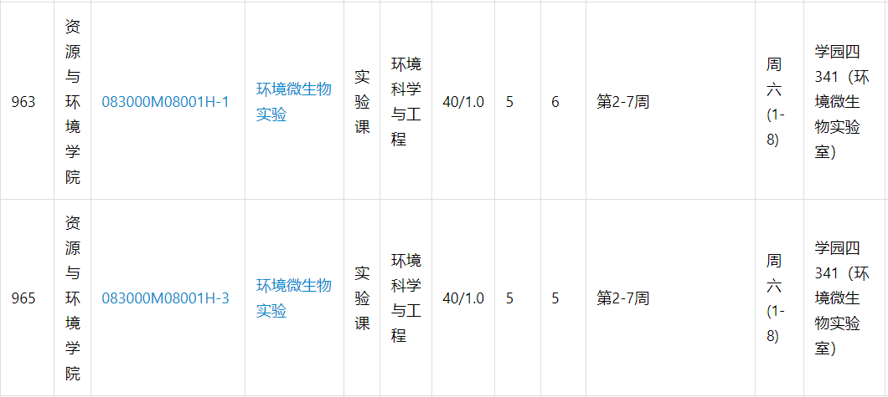
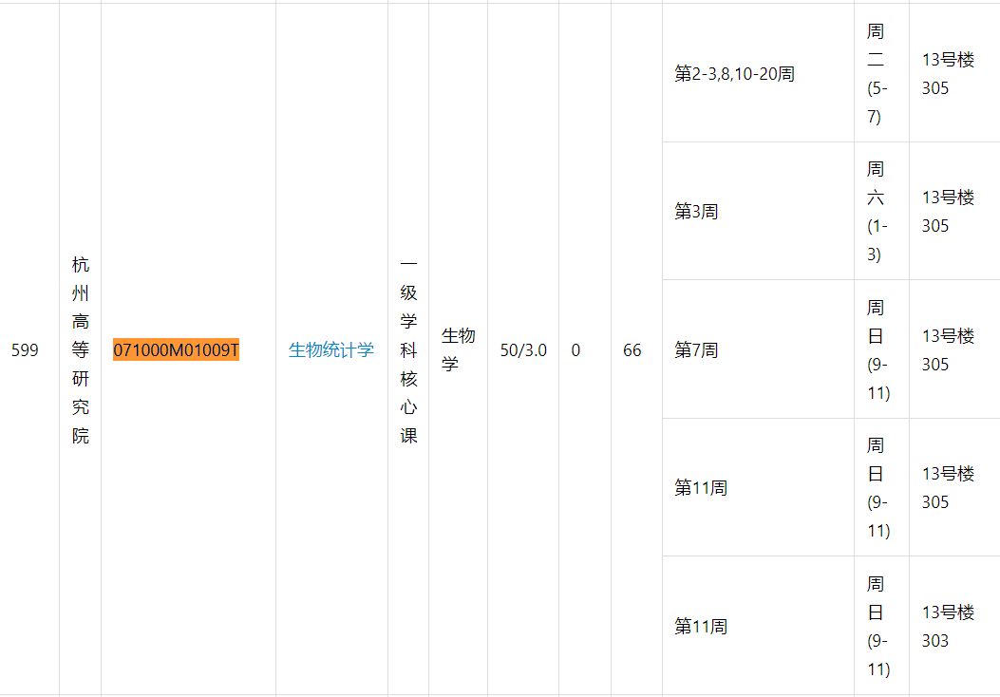
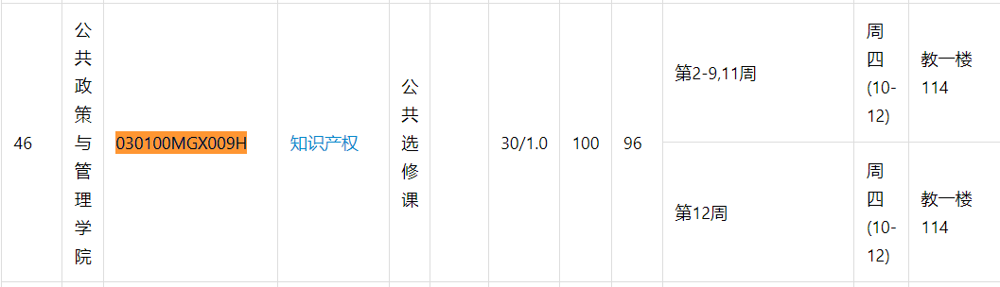
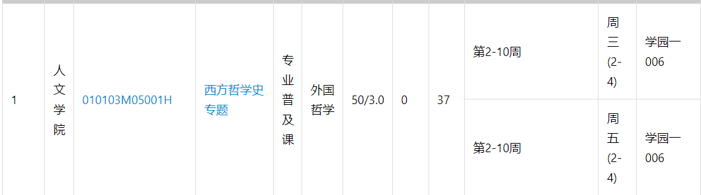
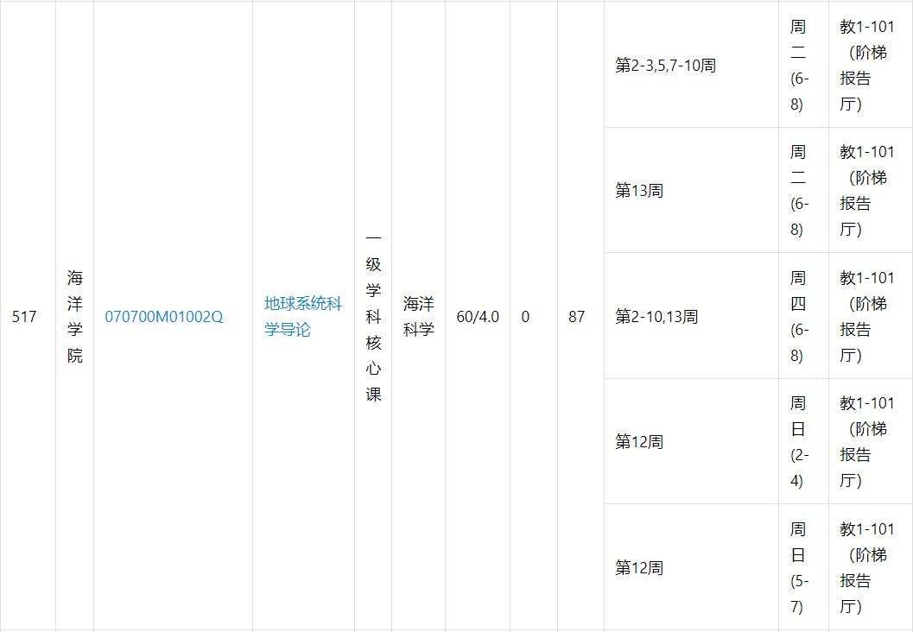
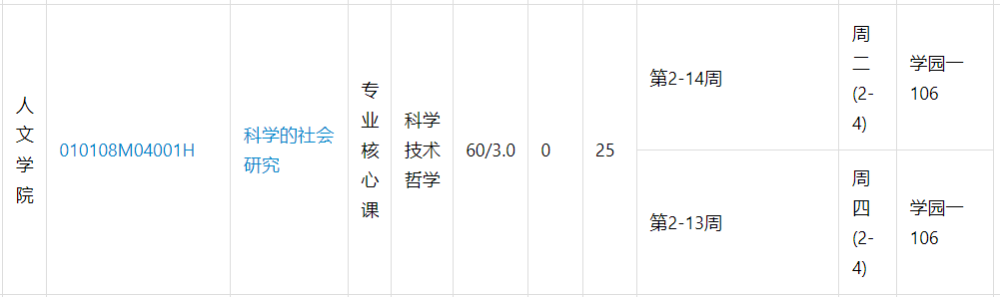

## Table class

| 列名        | 类型                   | 内容                         |
| ----------- | ---------------------- | ---------------------------- |
| school      | 可变字符串，长度20字符 | 课程所属学院                 |
| cid         | 可变字符串，长度25字符 | 课程编号                     |
| name        | 可变字符串，长度50字符 | 课程名                       |
| attribute   | 可变字符串，长度15字符 | 课程属性                     |
| major       | 可变字符串，长度63字符 | 课程所属专业，可能有多个     |
| time        | 无符号整数，长度2字节  | 课程课时                     |
| score       | 无符号整数，长度1字节  | 课程学分                     |
| seats       | 无符号整数，长度2字节  | 课程总人数                   |
| selected    | 无符号整数，长度2字节  | 课程已选人数                 |
| teachmethod | 可变字符串，长度10字符 | 授课方式                     |
| exam        | 可变字符串，长度10字符 | 考核方式                     |
| professor   | 可变字符串，长度50字符 | 首席教授                     |
| teacher     | 可变字符串，长度50字符 | 主讲教师                     |
| teachassist | 可变字符串，长度50字符 | 助教                         |
| remote      | 无符号整数，长度1字节  | 是否远程教学，值只有`1`和`0` |

- 主键为`cid`
- 对每列的数据类型不清楚，可以看`数据库.md`中的建表语句

## Table time

| 字段名    | 类型                   | 内容                       |
| --------- | ---------------------- | -------------------------- |
| cid       | 可变字符串，长度25字符 | 课程编号                   |
| week      | 无符号整数，长度4字节  | 上课周，以二进制方式储存   |
| weekday   | 无符号整数，长度4字节  | 上课日，以二进制方式存储   |
| section   | 无符号整数，长度4字节  | 上课节次，以二进制方式储存 |
| classroom | 可变字符串，长度50字符 | 课程教室地点               |

该表一个课程可能有多个条目。

- 所有字段一起构成联合主键，因为存在着边界数据：

  - `week`、`weekday`、`section`完全相同的课

    

  - 一节课同一时间在不同地点上课

    

- 以二进制方式存储：如001010，第一位和第三位为1（从第零位开始）

  - 假如是`week`，就表示第一周和第三周都上课
  - 假如是`section`，就表示第一节和第三节上课
  - 假如是`weekday`，就表示星期一和星期三上课

- 时间表条目可以合并的情况

  - `cid`、`weekday`、`section`、`classroom`都相同，可以把这些条目的`week`也合并

    

  - `cid`、`week`、`section`、`classroom`，都相同，可以把这些条目的`weekday`也合并

    

  - `cid`、`week`、`weekday`、`classroom`都相同，可以把这些条目的`section`也合并

    

    如上图第12周的情况

  - `cid`、`classroom`无法合并

    - 对于`cid`，在逻辑上，不应该有两节课在同一时间、地点上课
    - 对于`classroom`，虽然有同一节课在同一时间不同地点上课，但这样的情况很小，并且地点的合并破坏了地点这一列数据的原子性，因此不作合并

- 时间表条目不能合并的情况

  - 虽然`cid`、`section`、`classroom`都相同，但是`weekday`和`week`不同

    

## Table detail

查询时并不马上返回课程详细内容，因此将其作为另一个表，需要时再查询。

| 字段名   | 类型                     | 内容         |
| -------- | ------------------------ | ------------ |
| cid      | 可变字符串，长度25字符   | 课程编号     |
| outline  | 可变字符串，长度2900字符 | 课程大纲内容 |
| textbook | 可变字符串，长度200字符  | 教材信息     |
| refbook  | 可变字符串，长度2700字符 | 参考书       |
| teacher  | 可变字符串，长度7450字符 | 课程教师信息 |

- 主键为`cid`

## Table user

| 字段名   | 类型                   | 内容         |
| -------- | ---------------------- | ------------ |
| uid      | 无符号整数，长度4字节  | 用户id，自增 |
| username | 可变字符串，长度20字符 | 用户名       |
| password | 可变字符串，长度20字符 | 用户密码     |

## Table comment

| 字段名     | 类型                     | 内容         |
| ---------- | ------------------------ | ------------ |
| comment_id | 无符号整数，长度4字节    | 评论id，自增 |
| uid        | 无符号整数，长度4字节    | 用户id       |
| cid        | 可变字符串，长度25字符   | 课程id       |
| comment    | 可变字符串，长度1000字符 | 评论内容     |

## Table select

| 字段名 | 类型                   | 内容   |
| ------ | ---------------------- | ------ |
| uid    | 无符号整数，长度4字节  | 用户id |
| cid    | 可变字符串，长度25字符 | 课程id |
